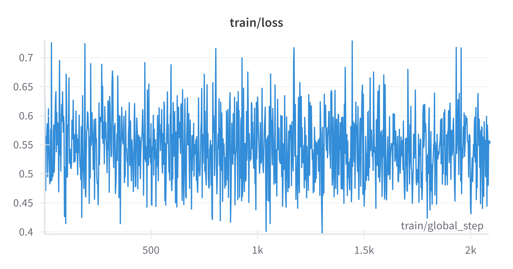
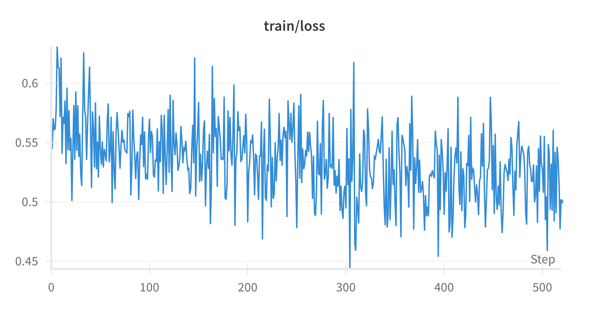

# Data Preparation
We use [`ise-uiuc/Magicoder-Evol-Instruct-110K`](https://huggingface.co/datasets/ise-uiuc/Magicoder-Evol-Instruct-110K) as our training data. You can get the formatted data and put it into `./datasets/code_sft` by running:
```bash
python examples/code_sft/get_data.py
```

# Training Configuration and Commands

## LoRA
The LoRA training configuration is shown in [config_lora.yaml](../../examples/code_sft/config_lora.yaml). Please modify your customized path of Aria model, Aria tokenizer and the code dataset. Additionally, we only use 0.3 ratio of the 110K dataset by setting: `datasets/code_sft: 0.3`. This setting can run well on single A100 (80GB) with 4k input sequence length.

> *Note:* In this configuration, we add LoRA on all modules in the LLM of Aria, without the vit and projector. If you want to add LoRA on vit/projector, you can adjust the `freeze_vit` or `freeze_projector`. You can also adjust `lora_target_modules` to choose the sub-modules of LLM blocks and `freeze_llm_layers` to set the layers where you don't want to add LoRA.

Command (on single 80GB A100):
```bash
CUDA_VISIBLE_DEVICES=0 python aria/train.py --config examples/code_sft/config_lora.yaml --output_dir [YOUR_OUT_DIR]
```

## Full Params
Full parameter finetuning is feasible with 8 H100 GPUs, using `ZeRO3` and `Offload Parameter`. The command is as following:
```bash
accelerate launch --config_file recipes/accelerate_configs/zero3_offload.yaml aria/train.py --config examples/code_sft/config_full.yaml --output_dir [YOUR_OUT_DIR]
```

# Evaluation and Results
> **Note:** If you train full params with DeepSpeed ZeRO, you need to extract the fp32 consolidated weights from ZeRO 1, 2, or 3 DeepSpeed checkpoints:
> ```bash
> cd /path/to/your/output/dir
> python zero_to_fp32.py . pytorch_model.bin
> ```

Run:
```bash
# Inference on HumanEval-Python
CUDA_VISIBLE_DEVICES=0 python examples/code_sft/inference.py \
    --base_model_path [YOUR_ARIA_PATH] \
    --tokenizer_path [YOUR_ARIA_TOKENIZER_PATH] \
    --save_root [YOUR_SAVE_DIR] \
    --peft_model_path [YOUR_LORA_PATH] # OPTIONAL

# Compute pass@1 score
python examples/code_sft/evaluation.py --save_root [YOUR_SAVE_DIR]
```

The `pass@1`:
| Aria                           | LoRA SFT               | Full Params SFT  |
|:-------------------------------------:|:-------------------------:|:-------:|
|75.00 | 76.22 | 75.61 |

# Loss Curve
These are the loss curves of `LoRA Finetuning` (left) and `Full Params Finetuning` (right):


<div style="display: flex; justify-content: space-between;">
    
    
</div>