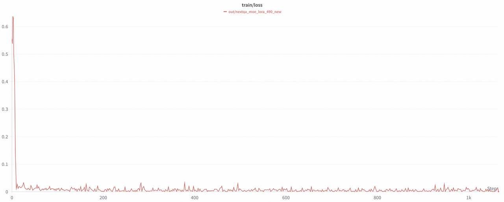
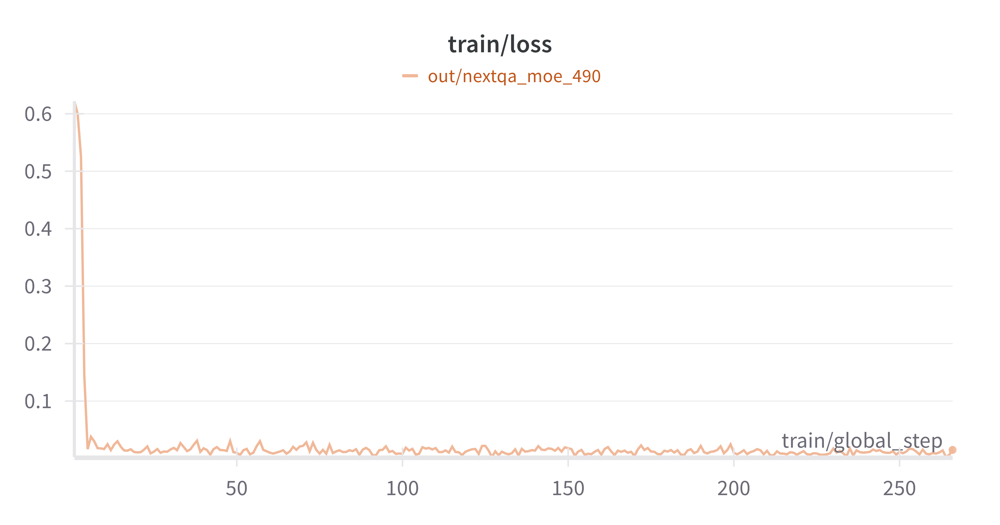

# Data Preparation
Please download the dataset from [Huggingface Datasets](https://huggingface.co/datasets/rhymes-ai/NeXTVideo/tree/main) and put the dataset in the `./datasets/nextqa` directory, running:
```bash
python examples/download_data_hf.py --hf_root rhymes-ai/NeXTVideo --save_root ./datasets/nextqa
```

Then please unzip the `.zip` files(including images and videos) inside each sub-folder.
```
cd ./datasets/nextqa
unzip NExTVideo.zip
```


# Training Configuration and Commands

## LoRA
The LoRA training configuration is shown in [config_lora.yaml](../../examples/nextqa/config_lora.yaml). Please modify your customized path of Aria model, Aria tokenizer and the nlvr2 dataset. This setting can run well on single A100 80GB using 4k sequence length due to longer visual context. We set the `max_image_size` to 490 for video datasets.

> *Note:* In this configuration, we add LoRA on all modules in the LLM of Aria, without the vit and projector. If you want to add LoRA on vit/projector, you can adjust the `freeze_vit` or `freeze_projector`. You can also adjust `lora_target_modules` to choose the sub-modules of LLM blocks and `freeze_llm_layers` to set the layers where you don't want to add LoRA.

Command (on single 80GB A100):
```bash
CUDA_VISIBLE_DEVICES=0 python aria/train.py --config examples/nextqa/config_lora.yaml --output_dir [YOUR_OUT_DIR]
```

## Full Params
Full paramater finetuning is feasible with 8 H100 GPUs, using `ZeRO3` and `Offload Parameter`. The command is as following:
```bash
accelerate launch --config_file recipes/accelerate_configs/zero3_offload.yaml aria/train.py --config examples/nextqa/config_full.yaml --output_dir [YOUR_OUT_DIR]
```

# Evaluation and Results
> **Note:** If you train full params with DeepSpeed ZeRO, you need to extract the fp32 consolidated weights from ZeRO 1, 2, or 3 DeepSpeed checkpoints:
> ```bash
> cd /path/to/your/output/dir
> python zero_to_fp32.py . pytorch_model.bin
> ```

After modifying the dataset paths in [NextQA-Evaluation](../../examples/nextqa/evaluation.py#L45), run::
```bash
CUDA_VISIBLE_DEVICES=0 python examples/nextqa/evaluation.py \
    --base_model_path [YOUR_ARIA_PATH] \
    --tokenizer_path [YOUR_ARIA_TOKENIZER_PATH] \
    --save_root [YOUR_SAVE_PATH] \
    --image_size [490] \
    --peft_model_path [YOUR_LORA_PATH] # OPTIONAL
```

The `Accuracy`:
| Aria                           | LoRA SFT               | Full Params SFT  |
|:-------------------------------------:|:-------------------------:|:-------:|
|78.14 | 80.80 | 81.42 |

## Loss Curve
These are the loss curves of `LoRA SFT` and `Full Params SFT`:

<div style="display: flex; justify-content: space-between;">
    
    
</div>
