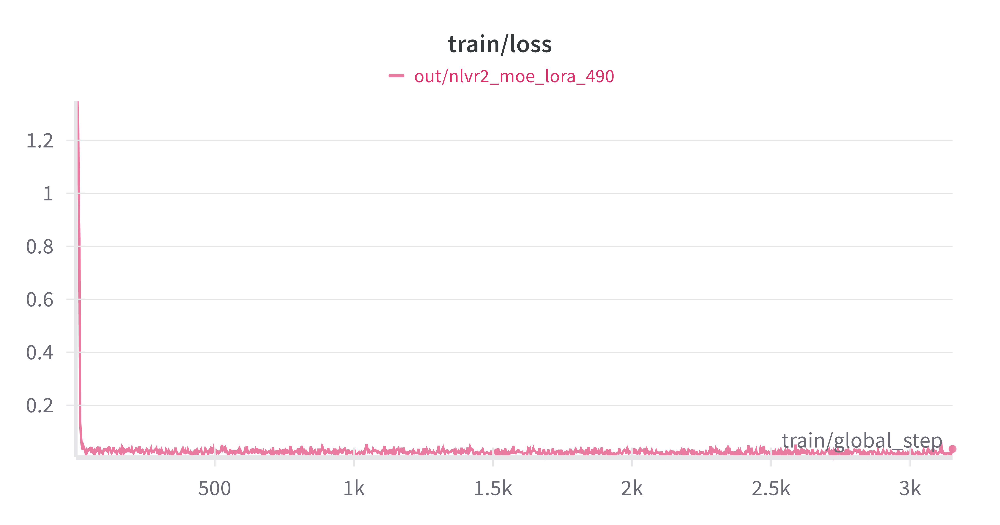
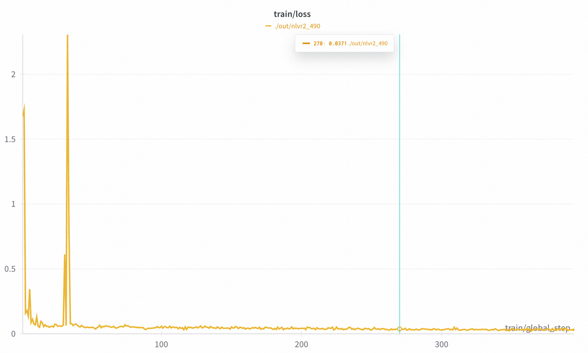
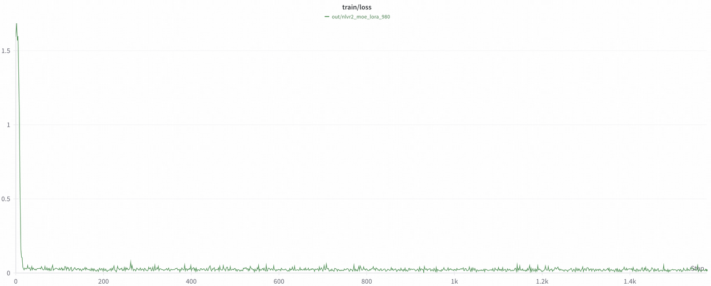
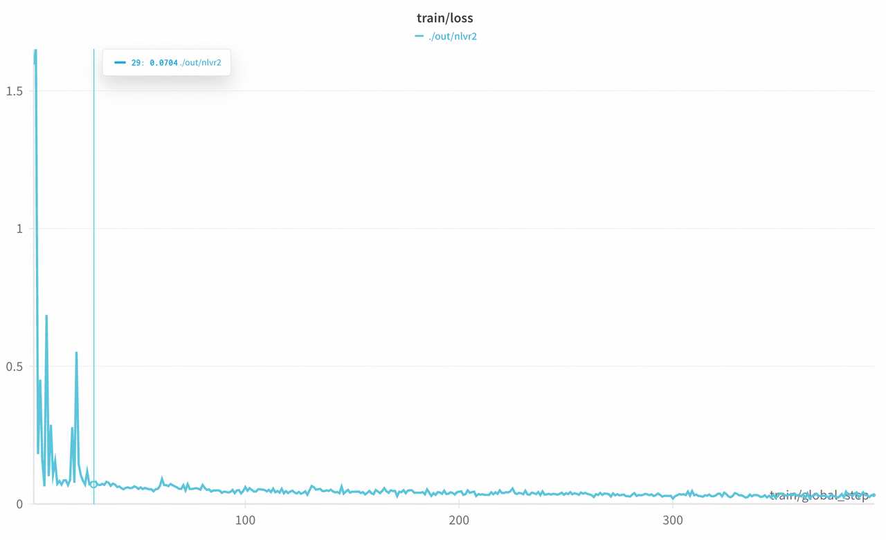

# Training Configuration and Commands

## LoRA
The LoRA training configuration is shown in [config_lora.yaml](../../examples/nlvr2/config_lora.yaml). Please modify your customized path of Aria model, Aria tokenizer and the nlvr2 dataset. This setting can run well on A100s (80GB) with 2k input sequence length. You can specify the `max_image_size` (e.g., 980 or 490) in the command line.

> *Note:* In this configuration, we add LoRA on all modules in the LLM of Aria, without the vit and projector. If you want to add LoRA on vit/projector, you can adjust the `freeze_vit` or `freeze_projector`. You can also adjust `lora_target_modules` to choose the sub-modules of LLM blocks and `freeze_llm_layers` to set the layers where you don't want to add LoRA.

Command (on two 80GB A100s):
```bash
accelerate launch --config_file recipes/accelerate_configs/zero2.yaml --num_processes 2 aria/train.py --config examples/nlvr2/config_lora.yaml --max_image_size 980 --output_dir [YOUR_OUT_DIR]
```

You can change the `max_image_size` to 490:
```bash
accelerate launch --config_file recipes/accelerate_configs/zero2.yaml --num_processes 2 aria/train.py --config examples/nlvr2/config_lora.yaml --max_image_size 490 --output_dir [YOUR_OUT_DIR]
```

## Full Params
Full paramater finetuning is feasible with 8 H100 GPUs, using `ZeRO3` and `Offload Parameter`. The command is as following:
```bash
accelerate launch --config_file recipes/accelerate_configs/zero3_offload.yaml aria/train.py --config examples/nlvr2/config_full.yaml --max_image_size 980 --output_dir [YOUR_OUT_DIR]
```

You can also adjust the `max_image_size` for full parameter training:
```bash
accelerate launch --config_file recipes/accelerate_configs/zero3_offload.yaml aria/train.py --config examples/nlvr2/config_full.yaml --max_image_size 490 --output_dir [YOUR_OUT_DIR]
```

# Evaluation and Results
After modifying the dataset paths in [NLVR2-Evaluation](../../examples/nlvr2/evaluation.py#L45), you can run:
```bash
CUDA_VISIBLE_DEVICES=0 python examples/nlvr2/evaluation.py \
    --base_model_path [YOUR_ARIA_PATH] \
    --tokenizer_path [YOUR_ARIA_TOKENIZER_PATH] \
    --save_root [YOUR_SAVE_PATH] \
    --image_size [490/980] \
    --peft_model_path [YOUR_LORA_PATH] # OPTIONAL
```

The `Accuracy`:
|        | Aria                           | LoRA SFT               | Full Params SFT  |
|:--------:|:-------------------------------------:|:-------------------------:|:-------:|
|490 |88.09 | 91.27 | 92.24 |
|980 |88.08 | 91.50 | 92.33 |

# Loss Curve
These are the loss curves of `LoRA Finetuning` (left) and `Full Params Finetuning` (right) with 490 and 980 `max_image_size`:

### 490
<div style="display: flex; justify-content: space-between;">
    
    
</div>

### 980
<div style="display: flex; justify-content: space-between;">
    
    
</div>
