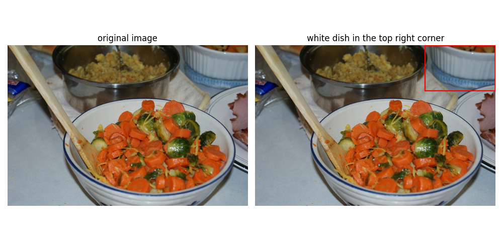
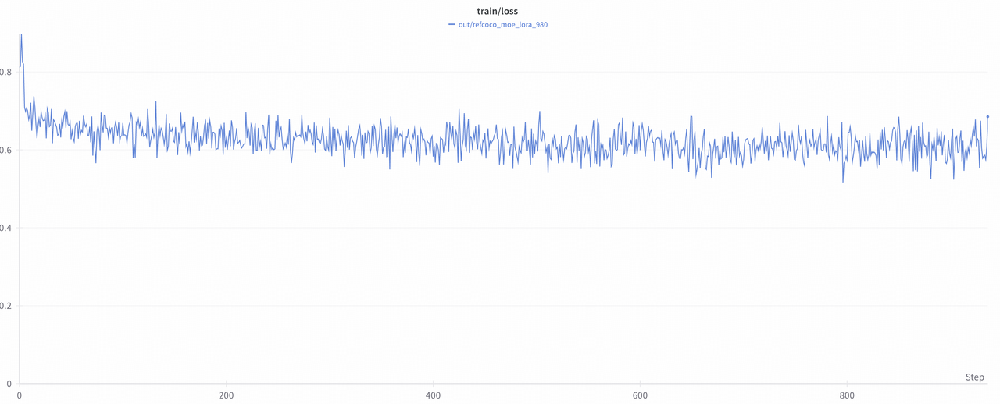
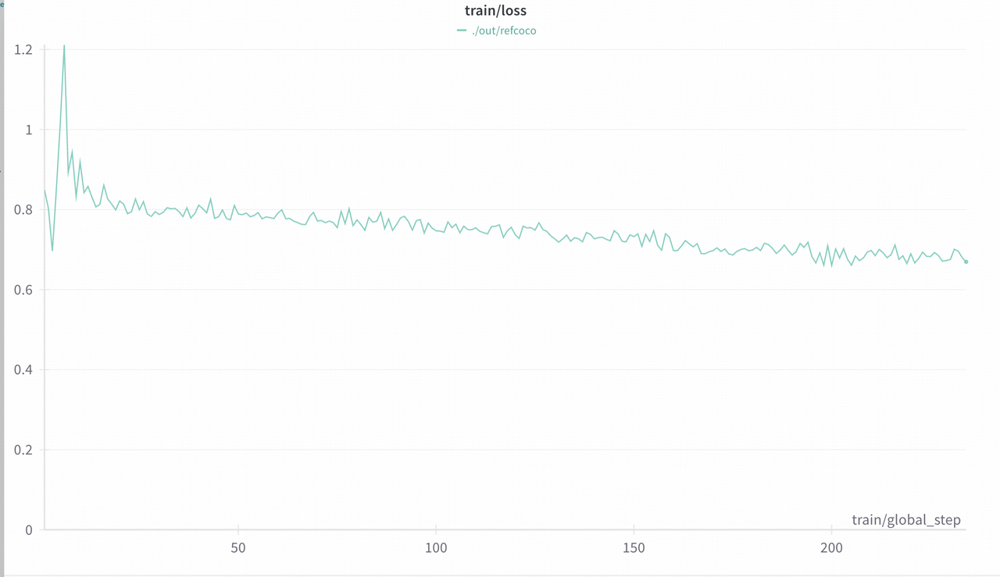

# Data Preparation
Please download the dataset from [Huggingface Datasets](https://huggingface.co/datasets/rhymes-ai/RefCOCO/tree/main) and put the dataset in the `./dataset/refcoco_sub30k` directory, running:
```bash
python examples/download_data_hf.py --hf_root rhymes-ai/RefCOCO --save_root ./dataset/refcoco_sub30k
```

Then please unzip the `.zip` files(including images and videos) inside each sub-folder.
```
cd ./dataset/refcoco_sub30k
unzip images.zip
```

# Training Configuration and Commands

## LoRA
The LoRA training configuration is shown in [config_lora.yaml](../../examples/refcoco/config_lora.yaml). Please modify your customized path of Aria model, Aria tokenizer and the refcoco dataset. This setting can run well on A100s (80GB) with 2k input sequence length. `max_image_size` is set to **980**.

> *Note:* In this configuration, we add LoRA on all modules in the LLM of Aria, without the vit and projector. If you want to add LoRA on vit/projector, you can adjust the `freeze_vit` or `freeze_projector`. You can also adjust `lora_target_modules` to choose the sub-modules of LLM blocks and `freeze_llm_layers` to set the layers where you don't want to add LoRA.

Command (on two 80GB A100s):
```bash
accelerate launch --config_file recipes/accelerate_configs/zero2.yaml --num_processes 2 aria/train.py --config examples/refcoco/config_lora.yaml --output_dir [YOUR_OUT_DIR]
```

## Full Params
Full paramater finetuning is feasible with 8 H100 GPUs, using `ZeRO3` and `Offload Parameter`. The command is as following:
```bash
accelerate launch --config_file recipes/accelerate_configs/zero3_offload.yaml aria/train.py --config examples/refcoco/config_full.yaml --output_dir [YOUR_OUT_DIR]
```

# Inference
We provide an [infernece script](./inference.py) to predict bounding box coordinates according to the input description of reference object, as shown:


Running:
```bash
CUDA_VISIBIE_DEVICES=0 python examples/refcoco/inference.py \
    --base_model_path [YOUR_ARIA_PATH] \
    --tokenizer_path [YOUR_ARIA_PATH] \
    --peft_model_path [YOUR_LORA_PATH] \
    --max_image_size 980 \
    --vis_bbox
```


# Evaluation and Results
After modifying the dataset paths in [RefCOCO-Evaluation](../../examples/refcoco/evaluation.py#L47), run:
```bash
CUDA_VISIBLE_DEVICES=0 python examples/refcoco/evaluation.py \
    --base_model_path [YOUR_ARIA_PATH] \
    --tokenizer_path [YOUR_ARIA_TOKENIZER_PATH] \
    --save_root [YOUR_SAVE_PATH] \
    --image_size 980 \
    --peft_model_path [YOUR_LORA_PATH] # OPTIONAL
```

The `Precision@1`:
| Aria                           | LoRA SFT               | Full Params SFT  |
|:-------------------------------------:|:-------------------------:|:-------:|
|41.77 | 88.92 | 88.85 |

# Loss Curve
These are the loss curves of `LoRA Finetuning` (left) and `Full Params Finetuning` (right):


<div style="display: flex; justify-content: space-between;">
    
    
</div>